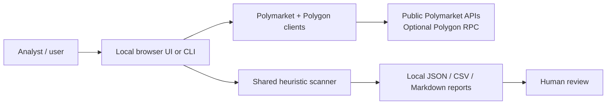
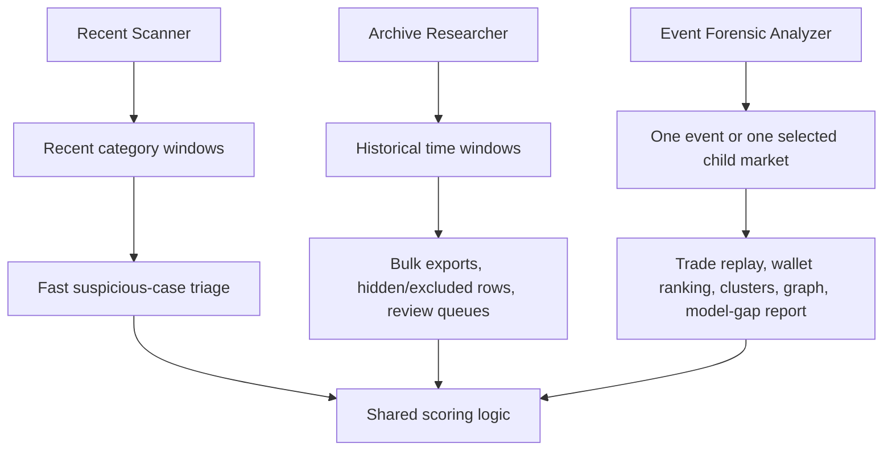

# InsPoly

InsPoly is an experimental, local-first toolkit for investigating suspicious Polymarket trading patterns around political, geopolitical, and high-impact event markets.

This is a raw project. It was vibe-coded by an enthusiast with basic coding experience, but with a strong practical understanding of insider-style trading logic: timing, information asymmetry, wallet behavior, position sizing, funding traces, market structure, and false-positive control.

This repository is an open experiment. Issues, pull requests, forks, critiques, test cases, documentation edits, and alternative approaches are welcome. It is not a production compliance system, not investment advice, and not proof that any wallet or trader committed wrongdoing. Treat every output as an analyst lead that requires independent review.

## What It Contains

InsPoly has three user-facing programs:

| Program | Command | Main purpose |
| --- | --- | --- |
| Recent Scanner | `python3 -m app desktop` or `python3 -m app scan` | Find suspicious recent trades across selected Polymarket categories. |
| Archive Researcher | `python3 -m app archive-desktop` | Research historical windows and export analyst-friendly CSV/JSON/Markdown bundles. |
| Event Forensic Analyzer | `python3 -m app event-desktop` | Analyze one event or one child market in depth, rank suspicious trades/wallets/clusters, and write evidence bundles. |

The active desktop experiences are local browser UIs served by Python. They are not hosted services and do not require a central backend controlled by this repository.



## How The Three Programs Differ



More detail:

- [Program guide](docs/PROGRAMS.md)
- [Architecture](docs/ARCHITECTURE.md)
- [Detection model](docs/DETECTION_MODEL.md)
- [Operations guide](docs/OPERATIONS.md)
- [Data safety](docs/DATA_SAFETY.md)

## Repository Map

| Path | What it is |
| --- | --- |
| `app/` | The runnable application: CLI, local browser servers, Polymarket clients, scoring, storage, and report writers. |
| `tools/` | Research, audit, validation, report-normalization, and diagnostic helpers. These are mostly operator/developer tools, not polished end-user commands. |
| `tests/` | Regression tests for scoring contracts, report schemas, diagnostics, and helper tools. |
| `docs/` | Public documentation for users and reviewers. Only curated public docs are tracked. |
| `.inspoly_runtime.env.example` | Safe runtime configuration template without secrets. |
| `Launch InsPoly*.command` | macOS double-click launchers that resolve paths relative to the repository root. |

## Installation

Requirements:

- Python 3.11 or newer
- macOS, Linux, or Windows with a browser
- Network access to Polymarket public APIs
- Optional: Polygon RPC endpoint if you want live funding-trace evidence

Setup:

```bash
python3 -m venv .venv
source .venv/bin/activate
python3 -m pip install -e .
```

The project currently relies mostly on the Python standard library. The browser UIs load React/Babel and fonts from public CDNs at runtime.

All documented commands assume you are running them from the repository root.

## Quick Start

Run the recent scanner UI:

```bash
python3 -m app desktop
```

Run a recent CLI scan:

```bash
python3 -m app scan --lookback 4h --categories "Politics,World,Ukraine,Middle East"
```

Run the archive researcher UI:

```bash
python3 -m app archive-desktop
```

Run the event forensic analyzer UI:

```bash
python3 -m app event-desktop
```

On macOS, the included launcher files can also be double-clicked from the repository root.

## Optional Runtime Configuration

The app reads `.inspoly_runtime.env` from the repository root if it exists. This file is intentionally ignored by git.

Start from the safe example:

```bash
cp .inspoly_runtime.env.example .inspoly_runtime.env
```

Do not commit real API keys, RPC URLs with credentials, private wallets, private notes, SQLite databases, or generated run outputs.

## Outputs

InsPoly writes local artifacts while it runs:

- `.inspoly*/` for local SQLite state and saved UI reports
- `outputs/` for recent scanner reports
- `archive_outputs/` for archive exports
- `event_forensic_outputs/` for event forensic bundles
- many `*_outputs/` directories for diagnostics and auxiliary reports

These directories are ignored by git because they may contain wallet addresses, analyst notes, local paths, cached evidence, and large generated files. Any shared example output should be small, curated, and reviewed first.

## Verification

Run the current test suite:

```bash
python3 -m unittest discover -s tests -p 'test_*.py'
```

Compile source files:

```bash
python3 -m py_compile app/*.py tools/*.py tests/*.py
```

Clean-clone smoke test:

```bash
python3 -m venv .venv
source .venv/bin/activate
python3 -m pip install -e .
python3 -m app --help
python3 -m app scan --help
python3 -m app inspect-wallet --help
python3 -m py_compile app/*.py tools/*.py tests/*.py
python3 -m unittest discover -s tests -p 'test_*.py'
```

The package name is `inspoly`, but the public launch path is currently `python3 -m app ...` from the cloned repository.

Some live workflows depend on external APIs and may fail when Polymarket or RPC providers rate-limit, change payloads, or block a request path.

## Join In

Everything here can be questioned and improved: code, docs, tests, UI, scoring assumptions, false-positive handling, event scope, performance, and validation methodology.

Useful ways to participate:

- open an issue with a bug, confusing result, false positive, missed case, or unclear documentation;
- propose a small code or documentation change;
- add tests around an existing behavior;
- run the tool on a case and describe what worked or failed;
- suggest a different heuristic, data source, workflow, or UI shape.

This is intentionally raw. Small, practical improvements are useful.

## Safety Boundary

InsPoly should not:

- accuse wallets or people of crimes;
- produce automated trading advice;
- use private data without consent;
- hardcode credentials;
- silently weaken false-positive controls;
- treat unresolved market PnL as truth;
- use LLM output as production scoring logic.

The tool is strongest when it produces transparent evidence packets for a human analyst to review.
