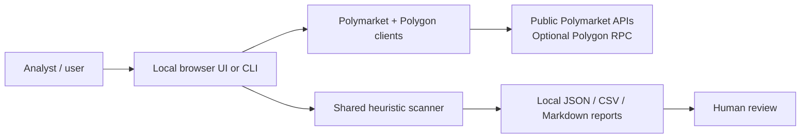
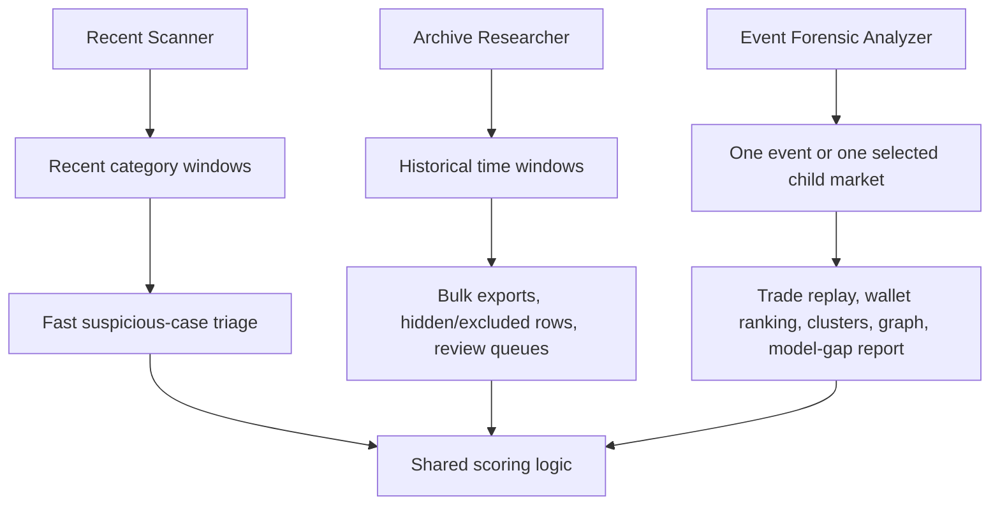

# InsPoly

InsPoly is an experimental, local-first analyst toolkit for investigating suspicious Polymarket trading patterns around political, geopolitical, and high-impact event markets.

This repository is an open experiment. Issues, pull requests, forks, critiques, test cases, documentation edits, and alternative approaches are welcome. It is not a production compliance system, not investment advice, and not proof that any wallet or trader committed wrongdoing. Treat every output as an analyst lead that requires independent review.

## What It Contains

InsPoly has three user-facing programs:

| Program | Command | Main purpose |
| --- | --- | --- |
| Recent Scanner | `python3 -m app desktop` or `python3 -m app scan` | Find suspicious recent trades across selected Polymarket categories. |
| Archive Researcher | `python3 -m app archive-desktop` | Research historical windows and export analyst-friendly CSV/JSON/Markdown bundles. |
| Event Forensic Analyzer | `python3 -m app event-desktop` | Analyze one event or one child market in depth, rank suspicious trades/wallets/clusters, and write evidence bundles. |

The active desktop experiences are local browser UIs served by Python. They are not hosted services and do not require a central backend controlled by this repository.



## How The Three Programs Differ



More detail:

- [Program guide](docs/PROGRAMS.md)
- [Architecture](docs/ARCHITECTURE.md)
- [Detection model](docs/DETECTION_MODEL.md)
- [Operations guide](docs/OPERATIONS.md)
- [Data safety](docs/DATA_SAFETY.md)
- [Security policy](SECURITY.md)
- [Contributing guide](CONTRIBUTING.md)

## Repository Map

| Path | What it is |
| --- | --- |
| `app/` | The runnable application: CLI, local browser servers, Polymarket clients, scoring, storage, and report writers. |
| `tools/` | Research, audit, validation, report-normalization, and diagnostic helpers. These are mostly operator/developer tools, not polished end-user commands. |
| `tests/` | Regression tests for scoring contracts, report schemas, diagnostics, and helper tools. |
| `docs/` | Public documentation for users and reviewers. Only curated public docs are tracked. |
| `.inspoly_runtime.env.example` | Safe runtime configuration template without secrets. |
| `Launch InsPoly*.command` | macOS double-click launchers that resolve paths relative to the repository root. |

## Installation

Requirements:

- Python 3.11 or newer
- macOS, Linux, or Windows with a browser
- Network access to Polymarket public APIs
- Optional: Polygon RPC endpoint if you want live funding-trace evidence

Setup:

```bash
python3 -m venv .venv
source .venv/bin/activate
python3 -m pip install -e .
```

The project currently relies mostly on the Python standard library. The browser UIs boot from pinned local React, ReactDOM, and Babel runtime assets under `app/vendor/browser/`; fonts use local system stacks rather than remote font services.

All documented commands assume you are running them from the repository root.

## Quick Start

Run the recent scanner UI:

```bash
inspoly desktop
# or
python3 -m app desktop
```

Run a recent CLI scan:

```bash
inspoly scan --lookback 4h --categories "Politics,World,Ukraine,Middle East"
# or
python3 -m app scan --lookback 4h --categories "Politics,World,Ukraine,Middle East"
```

Run the archive researcher UI:

```bash
inspoly archive-desktop
# or
python3 -m app archive-desktop
```

Run the event forensic analyzer UI:

```bash
inspoly event-desktop
# or
python3 -m app event-desktop
```

On macOS, the included launcher files can also be double-clicked from the repository root.

Optional native macOS wrapper:

```bash
python3 -m pip install -e ".[macos-app]"
python3 -m app macos-app
```

The native wrapper keeps the existing three local browser UIs and Python backends. It adds a start window with Recent Scanner, Archive Researcher, and Event Forensic Analyzer choices, plus native controls for stopping an active run and opening local outputs/logs.

To build the local fallback bundle at `dist/InsPoly.app`:

```bash
tools/build_macos_app.sh
```

To build a release DMG, supply Developer ID signing and notarization credentials outside the repo:

```bash
export INSPOLY_MACOS_SIGN_IDENTITY="Developer ID Application: Your Name (TEAMID)"
export INSPOLY_NOTARYTOOL_PROFILE="inspoly-notary-profile"
tools/build_macos_release.sh
```

The release script signs with hardened runtime, submits notarization, staples the DMG, and writes `dist/release/InsPoly.dmg.sha256`. Without credentials, use `tools/build_macos_release.sh --dry-run` to verify the clean staging path.

## Optional Runtime Configuration

The app reads `.inspoly_runtime.env` from the repository root if it exists. This file is intentionally ignored by git.

Start from the safe example:

```bash
cp .inspoly_runtime.env.example .inspoly_runtime.env
```

Do not commit real API keys, RPC URLs with credentials, private wallets, private notes, SQLite databases, or generated run outputs.

Funding traces are disabled by default. Set `INSPOLY_FUNDING_TRACE_MODE=live_rpc` only when you explicitly want live Polygon RPC lookups. Optional LLM review is also off unless configured; if enabled, selected case-packet context is sent from your local machine to the configured external provider.

`InsPoly.app` can keep the Mac awake while analysis is running. This prevents idle system sleep only; it does not override explicit Sleep, lid close, low battery, shutdown, or other macOS power decisions.

## Outputs

InsPoly writes local artifacts while it runs:

- `.inspoly*/` for local SQLite state and saved UI reports
- `outputs/` for recent scanner reports
- `archive_outputs/` for archive exports
- `event_forensic_outputs/` for event forensic bundles
- many `*_outputs/` directories for diagnostics and auxiliary reports

These directories are ignored by git because they may contain wallet addresses, analyst notes, local paths, cached evidence, and large generated files. Any shared example output should be small, curated, and reviewed first.

## Verification

Run the current test suite:

```bash
python3 -m unittest discover -s tests -p 'test_*.py'
```

Compile source files:

```bash
python3 -m compileall app tools tests
```

Run public repository hygiene checks:

```bash
python3 tools/public_repo_checks.py --all
```

Run the macOS release validation matrix:

```bash
tools/validate_macos_release.sh
```

For the first Event Forensic product-quality campaign after packaging, collect measurement-only performance evidence:

```bash
tools/run_event_forensic_performance_probe.sh
```

Clean-clone smoke test:

```bash
python3 -m venv .venv
source .venv/bin/activate
python3 -m pip install -e .
python3 -m app --help
inspoly --help
python3 -m app scan --help
python3 -m app inspect-wallet --help
python3 -m compileall app tools tests
python3 -m unittest discover -s tests -p 'test_*.py'
python3 tools/public_repo_checks.py --all
```

The package name is `inspoly`, and editable installs expose an `inspoly` command. `python3 -m app ...` remains supported for repository-local use.

Some live workflows depend on external APIs and may fail when Polymarket or RPC providers rate-limit, change payloads, or block a request path.

## Join In

Everything here can be questioned and improved: code, docs, tests, UI, scoring assumptions, false-positive handling, event scope, performance, and validation methodology.

Useful ways to participate:

- open an issue with a bug, confusing result, false positive, missed case, or unclear documentation;
- propose a small code or documentation change;
- add tests around an existing behavior;
- run the tool on a case and describe what worked or failed;
- suggest a different heuristic, data source, workflow, or UI shape.

Keep pull requests small and reviewable. Separate CI, packaging, browser security, docs cleanup, schema work, scoring refactors, and validation corpus changes.

## Safety Boundary

InsPoly should not:

- accuse wallets or people of crimes;
- produce automated trading advice;
- use private data without consent;
- hardcode credentials;
- silently weaken false-positive controls;
- treat unresolved market PnL as truth;
- use LLM output as production scoring logic.

The tool is strongest when it produces transparent evidence packets for a human analyst to review.
