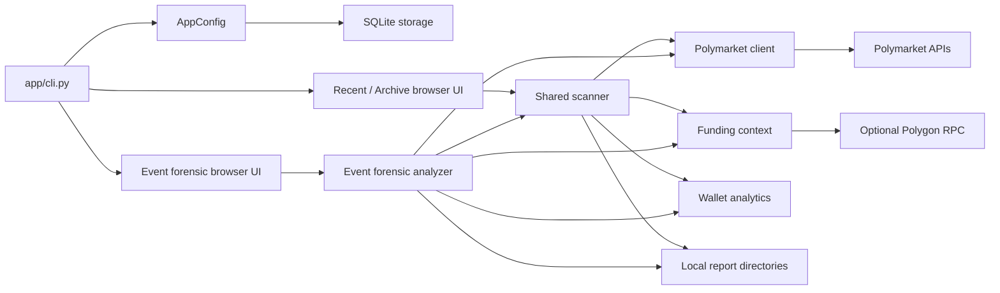
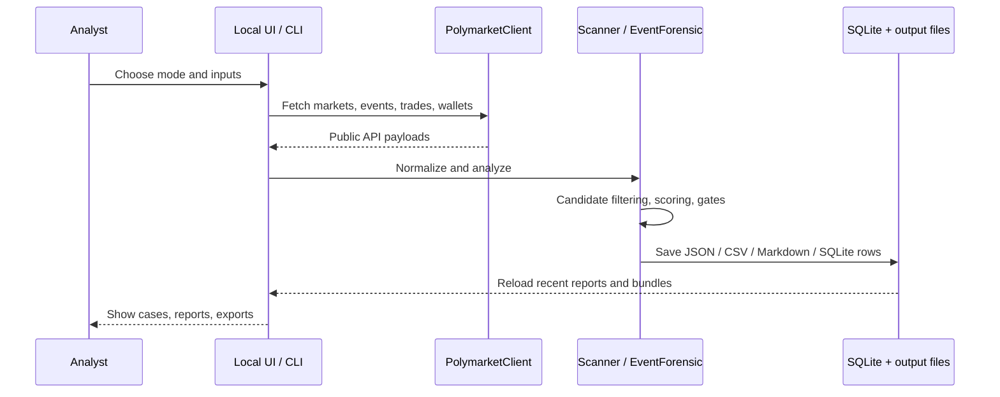

# Architecture

InsPoly is a local Python application with browser-based interfaces and a batch-first research workflow.

## High-Level Components

## Entry Points

- `python3 -m app scan`: CLI recent scan.
- `python3 -m app inspect-wallet`: wallet inspection helper.
- `python3 -m app desktop`: recent scanner browser UI.
- `python3 -m app archive-desktop`: archive researcher browser UI.
- `python3 -m app event-desktop`: event forensic browser UI.

The command router is `app/cli.py`.

## Core Runtime Modules

- `app/config.py`: local paths, runtime env loading, app-mode config.
- `app/polymarket.py`: Polymarket API and Polygon RPC access.
- `app/scanner.py`: shared suspicious-trade scoring and report writing.
- `app/archive_scanner.py`: historical-window research exports.
- `app/event_forensic.py`: event/market resolution, forensic replay, bundle writing.
- `app/wallet_analytics.py`: wallet history and performance context.
- `app/event_context.py`: event timing and optional offline timeline context.
- `app/funding_context.py`: funding trace and funding-quality context.
- `app/storage.py`: SQLite persistence for saved runs and flagged cases.
- `app/browser_desktop.py`: recent/archive browser backend.
- `app/event_forensic_desktop.py`: event forensic browser backend.
- `app/browser_ui.html`: recent/archive frontend.
- `app/browser_event_forensic_ui.html`: event forensic frontend.

## Data Flow

## Storage Layout

Runtime state is intentionally local:

- `.inspoly/`: recent scanner SQLite DB and saved reports.
- `.inspoly_archive_researcher/`: archive mode DB and reports.
- `.inspoly_event_forensic_analyzer/`: event forensic mode DB and reports.
- `outputs/`: recent scanner human-facing outputs.
- `archive_outputs/`: archive exports.
- `event_forensic_outputs/`: event forensic bundles.

These directories are ignored in git because they can contain live research artifacts, local paths, wallet addresses, and large generated files.

## External Dependencies

Runtime external services:

- Polymarket Gamma API
- Polymarket Data API
- Polymarket CLOB price endpoints
- Polymarket public pages as fallback event/market payload sources
- Optional Polygon RPC for on-chain funding traces

Frontend runtime assets:

- React/Babel and fonts are loaded from public CDNs by the local browser UIs.

## Compatibility Principles

InsPoly has accumulated compatibility logic for older saved reports and upstream API quirks. Avoid removing fallback paths unless you can prove the older behavior is no longer needed.

Important examples:

- Gamma pagination can return HTTP 422 at high offsets.
- Polymarket trade pagination can hard-stop around a fixed offset.
- Event/market slug resolution may need public-page `__NEXT_DATA__` fallback.
- Browser report loaders normalize legacy saved report shapes.
- Funding evidence must distinguish `unknown` from `none`.

