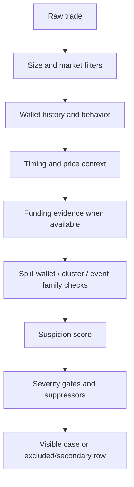

# Detection Model

InsPoly uses explainable heuristics, not machine learning. The model is designed to produce analyst leads with visible reasons, not final legal conclusions.

## Core Idea

Suspicious Polymarket activity is not just "a wallet made money." InsPoly looks for combinations of:

- unusual timing;
- large or concentrated position sizing;
- wallet dormancy or sudden reactivation;
- repeated event-family behavior;
- opening exposure before a market move;
- suspicious or shared funding context;
- linked-wallet behavior;
- low-probability early winner patterns when final outcomes are available;
- repricing behavior after an information event;
- false-positive suppressors such as near-certain entries, high-volume public users, stale public-lag trades, and mechanical repricing.

## Scoring Pipeline

## Evidence Families

Timing evidence:

- trade close to a resolution or major event;
- entry before a price move;
- unusual market timing relative to public information.

Wallet evidence:

- low history or dormant wallet;
- sudden reactivation;
- concentrated exposure;
- unusual wallet-level win patterns;
- repeated narrow event-family behavior.

Structure evidence:

- multiple wallets entering the same market/direction in a narrow time band;
- shared or suspicious funding;
- split-wallet style position building;
- clusters that look coordinated rather than independent.

Outcome evidence:

- final correctness when a market is resolved;
- low-probability early winner patterns;
- retrospective checks that are separated from live leads.

False-positive controls:

- near-certainty entries;
- stale resolution/public-lag behavior;
- bot-like or high-volume public behavior;
- mechanical repricing;
- weak or unknown funding evidence;
- unresolved events where final correctness is not yet knowable.

## Important Boundary

Funding evidence uses three important meanings:

- `strong` or `moderate`: qualifying evidence was found and passed quality checks.
- `none`: a funding lookup succeeded and found no qualifying suspicious evidence.
- `unknown`: lookup was unavailable, skipped, incomplete, failed, legacy, or not enough saved fields existed.

Do not treat `unknown` as clean.

## Why This Is Not ML

The system is intentionally rule-based because reviewers and maintainers need to inspect and challenge each assumption. A black-box model would make it harder to distinguish:

- real suspicious structure;
- public information effects;
- market mechanics;
- bad API data;
- insufficient context.

LLM-assisted review may be used for advisory summaries, but LLM output must not become production scoring logic without a separate, explicit, tested design.

## Cross-mode scoring contract

`_score_trade()` in `app/scanner.py` is the shared base scorer across InsPoly modes.

The modes are not identical:

- Recent Scanner displays base-scanner cases after recent-mode visibility and quality-screening rules.
- Archive Researcher reuses the base scorer, then assigns archive-specific visible, secondary-review, and excluded compatibility tiers.
- Event Forensic Analyzer replays the base scorer with `include_below_threshold=True`, stores `case.suspicion_score` as `existingModelScore`, and computes `eventForensicScore` as an event-local overlay for forensic prioritization.

Score names in the UI:

- Base scanner score: the shared `_score_trade()` suspicion score.
- Event forensic priority: event-local ranking that can include outcome/context overlays.
- Event concern: the compact trade-card display for `eventForensicScore`.

This distinction matters because a trade can be useful in one workflow and less useful in another. Contributors should not make the modes identical just to simplify code.
