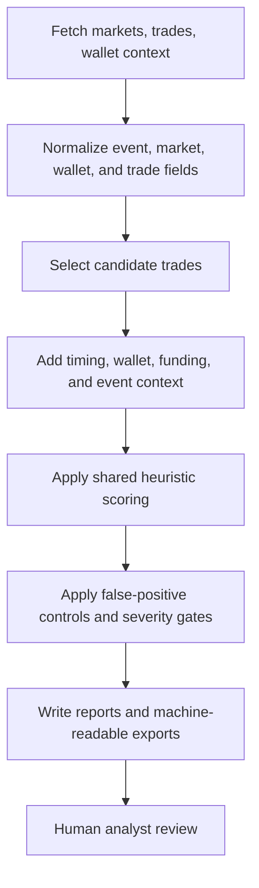

# Program Guide

InsPoly has three main programs. They share core scoring logic but answer different research questions.

## 1. Recent Scanner

Command:

```bash
python3 -m app desktop
python3 -m app scan --lookback 4h --categories "Politics,World,Ukraine,Middle East"
```

Goal:

- detect suspicious recent trades;
- scan selected Polymarket site categories;
- quickly surface cases that may deserve manual review.

Method:

1. Fetch Polymarket categories and focus markets.
2. Fetch recent trades inside a configurable lookback window.
3. Filter by category, size, market state, wallet behavior, and timing.
4. Enrich candidate trades with wallet history, optional funding context, and event timing context.
5. Score trades with the shared heuristic model.
6. Persist JSON, Markdown, and text reports.

Main files:

- `app/cli.py`
- `app/browser_desktop.py`
- `app/scanner.py`
- `app/polymarket.py`
- `app/storage.py`

Best use:

- daily or hourly triage;
- finding leads before an event resolves;
- reviewing recent high-impact political and geopolitical markets.

Limitations:

- recent scans can miss older setup behavior;
- external API pagination can truncate deep histories;
- unresolved markets do not provide final-outcome proof;
- high-volume public users and near-certain trades require careful false-positive handling.

## 2. Archive Researcher

Command:

```bash
python3 -m app archive-desktop
```

Goal:

- inspect historical windows;
- export large review bundles;
- compare visible candidates, excluded candidates, and diagnostic funnels.

Method:

1. Select historical start/end timestamps and categories.
2. Fetch broader trade windows from Polymarket.
3. Reuse the shared scanner scoring path.
4. Export analyst-ready files: candidates, visible cases, excluded/hidden rows, markdown reports, JSON summaries, and diagnostic artifacts.
5. Preserve enough context to review false positives and false negatives after the run.

Main files:

- `app/archive_scanner.py`
- `app/browser_desktop.py`
- `app/scanner.py`
- `tools/model_behavior_audit.py`
- supporting diagnostic tools under `tools/`

Best use:

- retrospective research;
- validating whether a scoring rule behaves reasonably across many markets;
- preparing review packets for humans;
- building benchmark or false-positive control material.

Limitations:

- large windows can be slow;
- Data API offset limits can truncate deep market history;
- saved outputs are local research artifacts and should not be published without review.

### Archive visibility contract

Archive Researcher uses an annotate-not-hide workflow. It should preserve review context instead of silently deleting borderline rows.

Important persisted/reporting fields:

- `visibility_tier`
- `visible_inclusion_status`
- `excluded_cases`

Current intended behavior:

- strong visible evidence remains visible;
- Hard Evidence Review rows remain reviewable;
- Secondary review rows are preserved as a visible review tier / compatibility path;
- `excluded_cases` is a legacy compatibility container and should not be read as proof that every row inside was worthless;
- archive visibility annotation must not rewrite the shared base score.

## 3. Event Forensic Analyzer

Command:

```bash
python3 -m app event-desktop
```

Goal:

- analyze one Polymarket event or one exact child market;
- rank suspicious trades, wallets, and linked wallet groups;
- produce a forensic bundle that can be audited later.

Method:

1. Resolve an event URL, market URL, event slug, market slug, or selected `condition_id`.
2. Decide scope:
   - whole event;
   - single child market;
   - optional related-market enrichment.
3. Fetch scoped trades and market metadata.
4. Replay shared scanner logic with event-specific context.
5. Build wallet rankings, clusters, graph data, suspicious trade CSVs, model-gap notes, and Markdown reports.
6. Save a directory bundle under `event_forensic_outputs/`.

Main files:

- `app/event_forensic.py`
- `app/event_forensic_desktop.py`
- `app/browser_event_forensic_ui.html`
- `app/scanner.py`
- `app/polymarket.py`

Best use:

- deep review of a public event after suspicious activity is suspected;
- single-market scope checks where sibling markets must not leak into primary evidence;
- retrospective analysis after outcomes are known;
- comparing model output with human judgment.

Limitations:

- live/unresolved events cannot use later-correctness as evidence;
- related-market expansion must stay conservative to avoid topic drift;
- funding traces require reliable Polygon RPC capacity;
- event bundles may contain wallet addresses and should be handled as research evidence.

## Shared Method Across All Programs



The shared principle is explainability. The model is intentionally heuristic and auditable rather than opaque.

## Development Orientation

When changing a program, start with the narrowest surface:

| Goal | Start here | Preserve |
| --- | --- | --- |
| Improve recent triage | `app/scanner.py`, `tests/test_scanner_patterns.py` | existing score fields, severity names, and false-positive suppressors |
| Improve historical exports | `app/archive_scanner.py`, archive/report tests | old report compatibility and archive visibility annotations |
| Improve event investigations | `app/event_forensic.py`, event forensic tests | single-market vs whole-event scope semantics |
| Improve UI display | `app/browser_ui.html`, `app/browser_event_forensic_ui.html`, browser backend payload builders | saved-report loading and legacy payload normalization |
| Improve public docs | `README.md`, `docs/*.md` | clear disclaimers that outputs are leads, not accusations |

Avoid changing shared scoring just to make one screen look cleaner. When a behavior differs between modes, document the mode-specific reason and add a focused regression test.
