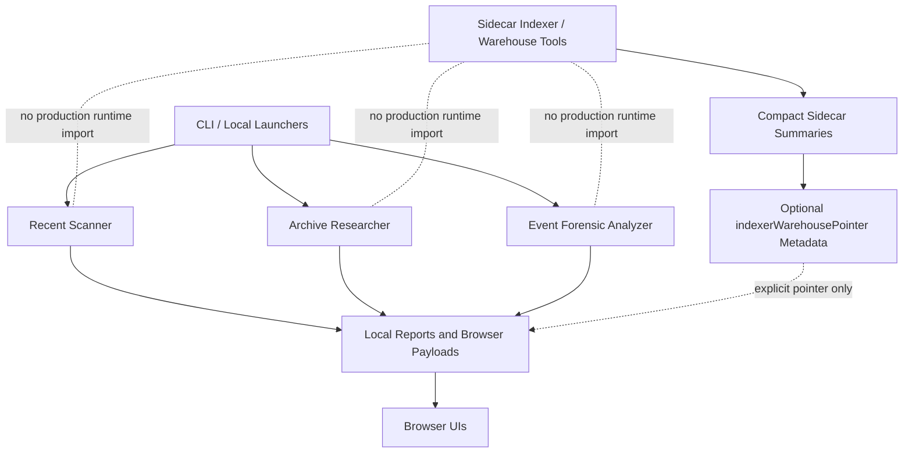
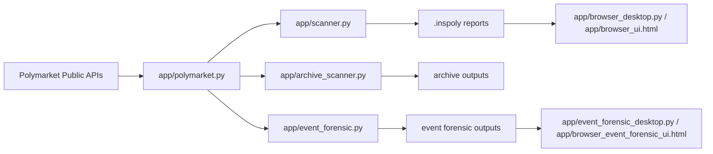
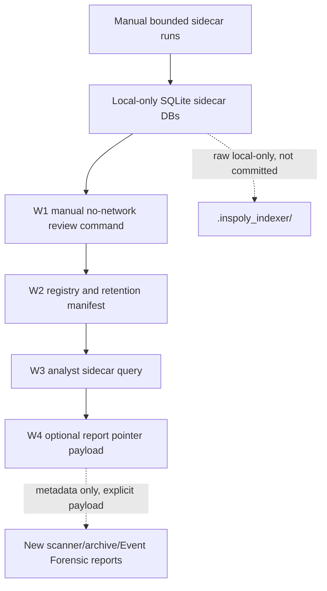

# InsPoly RC V4 Architecture Map - 2026-05-28

## Purpose

This document gives GitHub reviewers a compact map of the RC V4 architecture and the boundary between production report/runtime paths and sidecar-only indexer warehouse tooling.

## High-Level System

## Production Runtime Paths

Production runtime paths remain the scanner, archive researcher, Event Forensic analyzer, storage/report writers, and browser loaders. RC V4 does not add live indexer warehouse tools to these runtime paths.

## Sidecar Indexer Warehouse Boundary

Sidecar DBs and raw outputs remain local-only. W1/W2/W3 read compact local artifacts and produce advisory summaries. W4 only stores a pointer to compact sidecar artifacts when an explicit validated pointer payload is supplied.

## What Is Production Runtime vs Sidecar-Only

| Area | RC V4 Status |
| --- | --- |
| Scanner/archive/Event Forensic scoring | Production runtime, unchanged by publication |
| Browser report loading | Production runtime, no W4 UI panel |
| `indexerWarehousePointer` | Optional report metadata, absent by default |
| Indexer bounded live runner | Sidecar tool, not production runtime |
| Warehouse W1 manual command | Sidecar no-network tool |
| Warehouse W2 registry | Sidecar no-network manifest |
| Warehouse W3 query | Sidecar no-network query |
| Raw sidecar DBs | Local-only, not committed |
| Scheduler/background warehouse mode | Blocked |

## Review Focus

Reviewers should focus on whether optional pointer metadata stays additive and absent-safe, and whether sidecar tooling remains outside production runtime imports.
