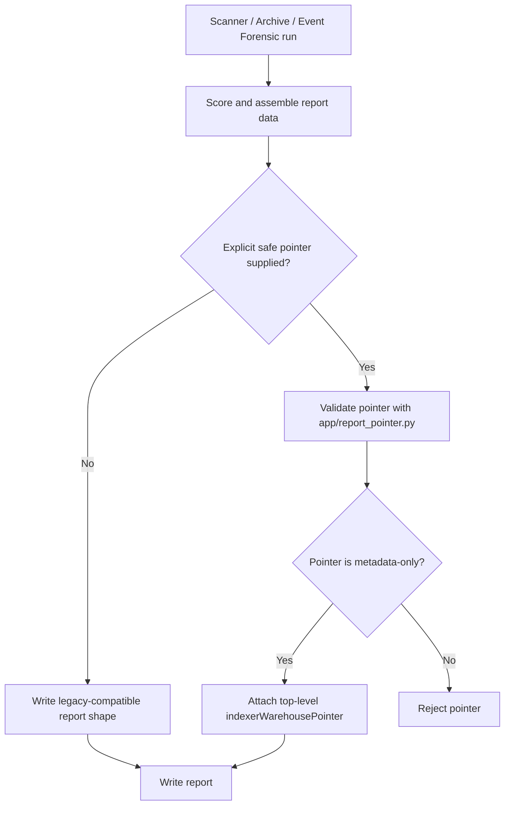
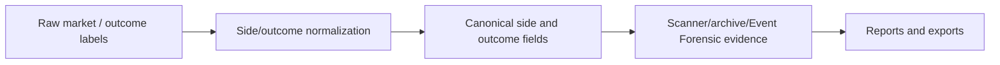
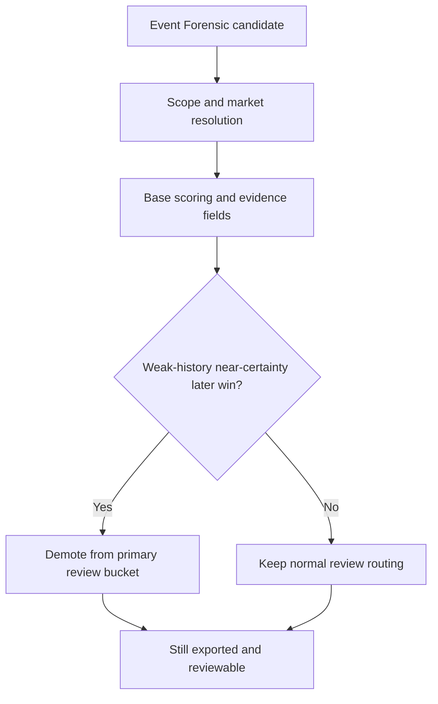
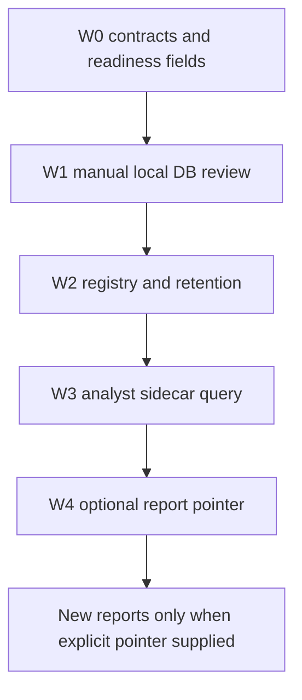

# InsPoly RC V4 Data Flow And Schemas - 2026-05-28

## Report Generation Flow



Reports without `indexerWarehousePointer` remain valid. The pointer is optional and absent by default.

## Optional Pointer Schema Example

```json
{
  "indexerWarehousePointer": {
    "pointerVersion": "indexer_warehouse_report_pointer_v1",
    "sidecarOnly": true,
    "advisoryOnly": true,
    "artifactType": "indexer_warehouse_query",
    "artifactPath": "validation_outputs/inspoly_indexer_warehouse_w3_query_run_20260527.json",
    "artifactId": "w3-query-20260527",
    "generatedAt": "2026-05-27T14:51:26+00:00",
    "sourceReportId": "example-report-id",
    "metricsCopied": false,
    "scoringEffect": false,
    "routingEffect": false,
    "uiRequired": false,
    "liveRefresh": false,
    "rawDbReadRequired": false,
    "registryPath": "validation_outputs/inspoly_indexer_warehouse_registry_20260527.json",
    "queryRunPath": "validation_outputs/inspoly_indexer_warehouse_w3_query_run_20260527.json",
    "localOnlyWarning": "The referenced sidecar artifact may be local-only and machine-specific.",
    "staleDataWarning": "The referenced sidecar artifact is historical and does not refresh live data.",
    "analystConfusionNote": "This pointer is advisory metadata only; it is not a verdict, ranking input, or report metric.",
    "qualityNotes": [
      "Pointer references compact sidecar evidence only."
    ]
  }
}
```

Forbidden pointer content includes market/trade/cursor counts, row-level cases, target rows, health verdicts as report evidence, scoring labels, funding conclusions, Phase 3 conclusions, wallets, trades, or copied metrics.

## Side And Outcome Normalization Flow



RC V4 does not change side/outcome scoring semantics. The GitHub publication packet only documents the current release state.

## Event Forensic Review Demotion Flow



The demotion is already part of RC V4 history. This publication campaign does not alter it.

## Warehouse W0-W4 Sidecar Pipeline



W0-W3 are sidecar/no-network review layers. W4 is a pointer to compact sidecar artifacts, not a warehouse integration.
